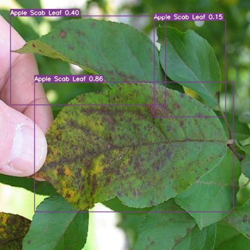

# Disease Identification

Plant disease identification is a core task in smart farming, which is the process of identifying different types of plant diseases to better understand and manage them. The goal of identifying plant diseases could be divided to two levels, **image classification** and **object detection**, which suit to different scenarios.

Image classification helps us to categorize **what** is contained in an images, while object detection in addition locate **where** is the objects in an image.
Below are two images, one is classified as apple leaf with scab and the other further identify where the apple scab leaves are in the image.

|Image classification|Object detection|
|:-:|:-:|
|||

Plant disease identification can be done using a variety of machine learning technologies, one of which is deep learning. Deep learning is a type of machine learning that involves training artificial neural networks on large datasets to recognize patterns and make precisions. It can be applied to a wide range of tasks, including image classification, object detection, natural language processing, and much more.

Once plant diseases have been identified, farmers can take targeted actions such as applying pesticides or using biological control methods to prevent or treat the diseases, which can help improve crop yields and reduce the need for chemical and other inputs.

## Deep learning in plant disease identification

### Datasets

To apply deep learning to plant disease identification, we first need to gather a large dataset of images of plants with and without specific diseases. These images can be collected using cameras or other imaging devices, such as drones or satellite imagery. We also need to label the images in the dataset, indicating which ones show plants with specific diseases and which ones show healthy plants.

However, very few publicly released datasets are available in the literature of plant disease identification. Below are a variety of plant disease datasets we collected in the literature.

| Dataset | Link |
| :------ | :---------- |
| PlantVillage | [🔗](https://data.mendeley.com/datasets/tywbtsjrjv/1) |
| PlantDoc     | [🔗](https://github.com/pratikkayal/PlantDoc-Dataset) [🔗](https://public.roboflow.com/object-detection/plantdoc) |
| PDR2018      | [🔗](https://github.com/xungeer29/AI-Challenger-Plant-Disease-Recognition) |
| FGVC8        | [🔗](https://www.kaggle.com/competitions/plant-pathology-2021-fgvc8/data) |
| MaizeInField | [🔗](https://www.kaggle.com/datasets/hamishcrazeai/maize-in-field-dataset) |
| Potato       | [🔗](https://drive.google.com/drive/folders/1FpcQA66pEg0XR8y5uEzWU__REPpqSAPD) |
| Grapevine ESCA | [🔗](https://data.mendeley.com/datasets/89cnxc58kj/1) |
| Soybean ASDID | [🔗](https://datadryad.org/stash/dataset/doi:10.5061/dryad.41ns1rnj3) |
| Cucumber     | [🔗](https://www.kaggle.com/datasets/kareem3egm/cucumber-plant-diseases-dataset) |
| Banana       | [🔗](https://data.mendeley.com/datasets/rjykr62kdh/1) |
| DiaMOS Pear  | [🔗](https://doi.org/10.5281/zenodo.5557313) |
| Cassava      | [🔗](https://www.kaggle.com/competitions/cassava-leaf-disease-classification/overview) |

### Models

Once we have collected and labeled a dataset, or acquired a public dataset as above, we can use it to train a deep learning model. This involves building an artificial neural network and feeding it the labels images as input. The model will learn to recognize patterns and features that are indicative of specific diseases. We can then use the trained model to analyze new images of plants and predict whether they show signs of a specific disease.

There are many different deep learning models that can be used for plant disease classification and detection, and the best choice will depend on  a number of factors, such as the size and complexity of the dataset, the specific disease being detected, and the desired performance and speed. Some popular deep learning models that have been used for plant disease classification and detection include:

`Convolutional neural networks (CNNs)`

: CNNs are a type of feed-forward neural network that is commonly used for image classification and object detection tasks. They are composed of multiply layers of interconnected neurons, and they use convolutional operations to extract features for input images.

`Region-based CNNs (R-CNNs)`

: R-CNNs are a type of CNN that is designed for object detection tasks. They use a combination of a CNN and a region proposal algorithm to identify regions of the image that are likely to contain objects, and they use the CNN to classify the objects and predict their bounding boxes.

`You Only Look Once (YOLO)`

: YOLO is a real-time object detection system that uses a single CNN to predict the bounding boxes and class labels of objects in an image. It achieves this by handling object detection as a regression problem rather than a classification problem. YOLO is known for its high speed and good performance on a variety of object detection tasks. YOLOV7 and YOLOV5 are two state-of-the-art implements till now.

`Single Shot Multibox Detector (SSD)`

: Similar to YOLO, SSD also use a single CNN to predict the bounding boxes and class labels of object in an image. The feature that sets it apart from YOLO is its approach to bounding-box regression.

`Transformer-based Detection`

: In transformer-based object detection models, transformers are typically used in conjunction with a CNN to process the images. The CNN is used to extract features from the images, and the transformer is then used to process the features and perform the object detection via s bipartite matching training objective. Detection Transformer (DETR) is a state-of-the-art implementation till now.
